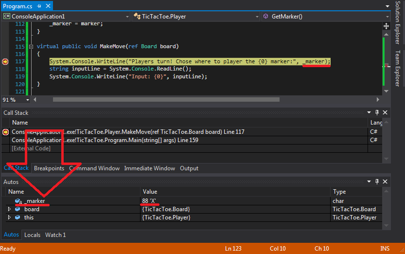

class: center, middle
# Make Your Own Program

By Nathan Ross Powell

Source: [make_your_own_program/README.md](https://github.com/nathanrosspowell/presentations/blob/master/src/beginner_guides/make_your_own_program/README.md)
Webpage: [make_your_own_program/index.html](http://nathanrosspowell.com/presentations/beginner_guides/make_your_own_program)
???

These are where the slide notes go.

---

# Intro

First, we will go over how to use the debugger more effectively.

You will have used the debugger for the practical work in this series.
This code, while challenging, has been kept as minimal as possible.
When making your own programs you will add _A LOT_ of code.
It is important to be able to use the debugger to correctly identify the mistakes you have made.

Secondly, we will outline potential personal projects.

To make your own program you need to set your own goals and requirements.
These will be different for each person and it will lead to everyone having their own solutions.
Hopefully everything you've learned (and been refreshed on) will come in useful!

---

class: center, middle
# Debugging

* Breakpoints
* Program Counter
* Call stack
* Watch Window

---

# Breakpoints

* Red mark set on code lines
* Set with `F9`
* Stops the program BEFORE that line of code runs

 

---

# Program Counter

* Yellow arrow on code line
* Step into function with `F11`
* Step to next line with `F10`

---

# Call stack

* Shows the call stack for where the program is stopped 
* You can double click on the function to jump there
* All variables from function in the call stack can be inspected

---

# Watch window

* Add variable names to the watch window
* 'Autos' picks variables for you automatically
* Click the drop down arrow to see variables inside of classes

---

class: center, middle
# Code Your Own Project

Ideas for making something on your own.

---

# Personal Projects

* Command console game
    * Tic Tac Toe
        * Boilerplate `C#` version provided
        * Also in `C++`
    * A game of your own choice
        * Solitaire (counter version)
        * Connect 4
        * etc
* `C#` GUI tool
    * A program to report on the condense of a file
        * A 'open file' boilerplate program provided
    * A utility program to automate a task
        * Pick a repetitive task that you want to make easier
        * Think if you could automate that
* Anything else...
    * If you have something specific, that is best!
    * Support will be provided 

---

# Make A Game

In general, games work with inputs and outputs from a device.

In the boilerplate for Tic Tac Toe (see the practical work), the program responds to typing in a grid coordinate.
In console games the program responds to controller input.
The concepts are exactly the same.

Use the supplied code to finish make Tic Tac Toe or use it as a starting point for your own game:
* Connect 4
* Solitaire
* ... anything

---

# Make A Tool

In general, tools work with input and outputs from files.

A tool or utility program will help you do a job that you would do by hand on the computer.
Example: Reading input from files (XML) and using that information to make output new files (binary data for PS4).

A tool can speed the task of finding out information from data.
In the boilerplate WPF program you can open a text file and it will give you the word count.

Maybe there are other things you would want to do with a text file:
* Count how many times a certain word/phrase (from an input box) is found in the text
* Output a new file with only the lines containing a certain word/phrase
* Output the text as [CSV](http://en.wikipedia.org/wiki/Comma-separated_values) which can be read opened as a spreadsheet

---

# Make Anything!

If there is something else that you would rather do, go for it!

Having a clear goal that you want to achieve is key to staying motivated.
Remember a few things:
* There are many solutions to a problem
* If it works, it can't be wrong!
* Every solution can always be improved
* Failing is the best way to learn - so don't give up

---
class: center, middle
# Questions?

???
Notes: ... 
---
class: center, middle
# End

Got back to the [make_your_own_program](http://nathanrosspowell.com/presentations/beginner_guides/make_your_own_program) page to see the practical work.
???
Notes: ... 
